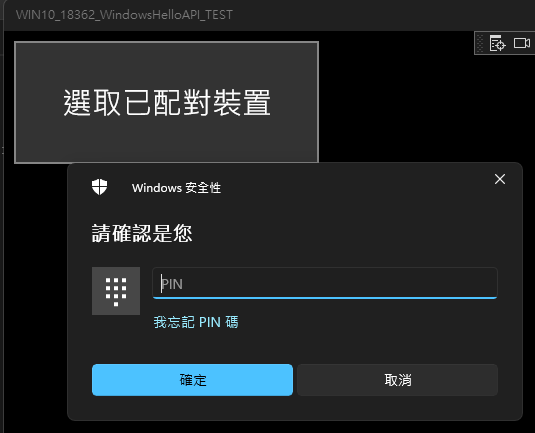

# 使用裝置解鎖電腦  

https://github.com/hanlinyah/UnlockMyPC/assets/88433897/fe3ad314-f02b-4d20-9e05-75a267dfc4c1

 
---


#### 更新歷程

2023.12.15  
完成基本功能-使用藍芽裝置解鎖

2023.12.27  
增加功能：  
1. 增加使用USB裝置解鎖功能
2. 限制藍芽、USB裝置綁定數量上限各為1個
3. 增加USB及藍芽裝置單驗證、雙驗證共四種解鎖模式，以增加安全性
4. 綁定未配對藍芽裝置時，協助進行配對
5. 增加藍芽裝置重新配對功能，以因應藍芽裝置連線不穩之情形
6. 綁定裝置以名稱顯示，並於選擇綁定裝置選單顯示曾選取過裝置之ID資訊(重開機清除)

## 1.動機

1. 工作攜帶用電腦(作業系統為Win 11)離開位置會進行鎖定以保護隱私，每次回座位皆須重新輸入密碼解鎖仍有些不便  

2. 作業系統自帶動態鎖定僅提供自動鎖定功能，而工作攜帶用電腦無法使用WinHello提供臉部或指紋辨識功能  
  


綜合上述，希望有較便利的解鎖功能(例如利用裝置解鎖)解決這個問題  

## 2.需求描述

透過配對藍芽裝置或插入自行提供之USB裝置註冊解除Windows 11登入鎖定

## 3.尋求解方

1. 國外的[文件](https://baydachnyy.com/2017/04/28/uwp-working-with-bluetooth-devices-part-1/)提及透過微軟的UWP應用程式實現藍芽裝置配對，對岸的[文件](https://www.cnblogs.com/alwaysking/p/7256207.html)，則提及透過微軟的UWP應用程式解鎖電腦，該文件是參考引用微軟的Windows Hello隨附裝置架構[文件](https://learn.microsoft.com/zh-tw/windows/uwp/security/companion-device-unlock)，連結內包含[範例](https://github.com/Microsoft/companion-device-framework)，但文中提及Windows Hello隨附裝置架構API於Windows 10 2004 版中已淘汰  


2. 微軟應用程式商店亦有藍芽(透過小米手環)解鎖電腦的App([Mi Blaze Unlock](https://apps.microsoft.com/detail/9NBLGGH43K0T?hl=zh-TW&gl=US))，說明中提到版本需求為Win10 Build 19043以下，但評論提及Win11仍可使用，因此使用手邊的小米手環進行驗證，經測試該App於Win11仍可正常運作(需要[變更國家或地區](https://support.microsoft.com/zh-tw/account-billing/%E5%9C%A8-microsoft-store-%E4%B8%AD%E8%AE%8A%E6%9B%B4%E6%82%A8%E7%9A%84%E5%9C%8B%E5%AE%B6%E6%88%96%E5%9C%B0%E5%8D%80-5895e006-34f4-10f7-16b1-999e40adb048)才可以安裝)  
  
  
  


3. 雖然Win10 2004 API已淘汰Windows Hello隨附裝置架構API，是否確實無法調用，仍需實際測試，於是查詢Windows 10 2004 對應的Build為[19041](https://en.wikipedia.org/wiki/Windows_10_version_history)，打算作為分界點就前後SDK版本調用該[API](https://learn.microsoft.com/zh-tw/uwp/api/windows.security.authentication.identity.provider.secondaryauthenticationfactorauthenticationstatus?view=winrt-19041)進行驗證  


## 4.測試三種版本Windows SDK是否均可呼叫Windows Hello隨附裝置架構API

1. 下載[Visual Studio 2022](https://visualstudio.microsoft.com/zh-hant/vs/whatsnew/)，選擇Windows通用平台開發，為了測試不同的SDK版本是否可呼叫Windows Hello隨附裝置架構API，除了預設之Windows 11 SDK(10.0.22621.0)外，也裝了Windows 10 SDK(10.0.19041.0)及Windows 10 SDK(10.0.18362.0)，經驗證各版本均可正常呼叫，詳細適用版本可參考微軟API[文件](https://learn.microsoft.com/zh-cn/uwp/api/windows.security.authentication.identity.provider.secondaryauthenticationfactorregistration.findallregistereddeviceinfoasync?view=winrt-22621)(摘錄：適用Build 14383以上版本)  
  

2. 要使用Windows Hello隨附裝置架構API需要先設定PIN碼  


3. 由於運行階段需要需要開啟開發人員模式，所以要到控制台設定  
  
  

### 4.1 Windows 10 SDK(10.0.18362.0)測試情形

1. 新建一個UWP專案，Package.appxmanifest文件內上方要加上`xmlns:rescap="http://schemas.microsoft.com/appx/manifest/foundation/windows10/restrictedcapabilities"`，IgnorableNamespaces的地方要加上rescap，下方Capabilities要設定`<rescap:Capability Name="secondaryAuthenticationFactor" />`，這邊為了拿藍芽裝置實驗，加上了`<DeviceCapability Name="bluetooth"/>`，請注意屬性放置的[順序](https://stackoverflow.com/questions/42356911/uwp-manifest-issue-restricted-capability-inputforegroundobservation)  

    * Package.appxmanifest

        ``` xml
        <Package
        xmlns="http://schemas.microsoft.com/appx/manifest/foundation/windows10"
        xmlns:mp="http://schemas.microsoft.com/appx/2014/phone/manifest"
        xmlns:uap="http://schemas.microsoft.com/appx/manifest/uap/windows10"
        xmlns:rescap="http://schemas.microsoft.com/appx/manifest/foundation/windows10/restrictedcapabilities"
        IgnorableNamespaces="uap mp rescap">
        ```

        ``` xml
        <Capabilities>
            <rescap:Capability Name="secondaryAuthenticationFactor" />
            <DeviceCapability Name="bluetooth"/>
        </Capabilities>
        ```

2. 編輯MainPage.xaml文件，從工具箱拖曳按鈕並撰寫按鈕點擊時執行的方法(MainPage.xaml.cs文件內)，要注意的是調用RequestStartRegisteringDeviceAsync方法內的DeviceId字串長度不能超過40字(實測結果)，否則會報錯(因此此處調用Replace方法，將測試之裝置ID前餟"Bluetooth#Bluetooth"字樣去除)
    * MainPage.xaml

        ``` xml
        <Grid>
            <Button Content="選取已配對裝置" Margin="10,10,0,0" VerticalAlignment="Top" Height="123" Width="305" FontSize="30" Click="Button_Click" />
        </Grid>
        ```

    * MainPage.xaml.cs

        ```c#
        private async void Button_Click(object sender, RoutedEventArgs e)
        {
            DevicePicker picker = new DevicePicker();
            picker.Filter.SupportedDeviceSelectors.Add(
                    BluetoothDevice.GetDeviceSelectorFromPairingState(true)
                );
            Debug.WriteLine("before Reg");
            DeviceInformation device = await picker.PickSingleDeviceAsync(new Rect());
            if (device != null)
            {
                Debug.WriteLine("device:" + device.Name);

                DeviceRegistration(device);
            }
            Debug.WriteLine("after Reg");
        }
        public async void DeviceRegistration(DeviceInformation device)
        {
            
            IBuffer deviceKey = CryptographicBuffer.GenerateRandom(256 / 8);
            BluetoothDevice bluetoothDevice = await BluetoothDevice.FromIdAsync(device.Id);
            Debug.WriteLine("bluetoothDevice:" + bluetoothDevice.Name);
            IBuffer mutualAuthenticationKey = CryptographicBuffer.GenerateRandom(256 / 8);
            Debug.WriteLine("bluetoothDeviceId:" + bluetoothDevice.BluetoothDeviceId.Id);
            Debug.WriteLine("bluetoothDeviceId_Replace:" + bluetoothDevice.BluetoothDeviceId.Id.Replace("Bluetooth#Bluetooth", ""));
            Debug.WriteLine("Name:" + bluetoothDevice.Name);
            Debug.WriteLine("deviceKey:" + CryptographicBuffer.EncodeToHexString(deviceKey));
            Debug.WriteLine("mutualAuthenticationKey:" + CryptographicBuffer.EncodeToHexString(mutualAuthenticationKey));
            SecondaryAuthenticationFactorRegistrationResult registrationResult =
                await SecondaryAuthenticationFactorRegistration.RequestStartRegisteringDeviceAsync(
                bluetoothDevice.BluetoothDeviceId.Id.Replace("Bluetooth#Bluetooth", ""),
                SecondaryAuthenticationFactorDeviceCapabilities.SecureStorage,
                bluetoothDevice.Name,
                "MyDevice",
                deviceKey,
                mutualAuthenticationKey);
        }
        ```

3. 點選開始偵錯，驗證Windows Hello隨附裝置架構API可成功呼叫  


### 4.2 Windows 10 SDK(10.0.19410.0)測試情形

與前一步驟進行同樣操作，可透過新建一個專案設定目標版本(這邊是使用新建專案進行測試)，亦可於既有專案(右鍵)屬性設定目標版本，會提示Windows Hello隨附裝置架構API已經過時，但執行後發現仍可呼叫API  
  
  
  


### 4.3 Windows 11 SDK(10.0.22621.0)測試情形

與前一步驟進行同樣操作，可透過新建一個專案設定目標版本(這邊是使用新建專案進行測試)，亦可於既有專案(右鍵)屬性設定目標版本，會提示Windows Hello隨附裝置架構API已經過時，但執行後發現仍可呼叫API  
  
  


## 5 完成基本需求

基本上主要是參考軟體提供的Windows Hello解鎖電腦[範例](https://github.com/Microsoft/companion-device-framework)及列舉設備[範例](https://github.com/Microsoft/Windows-universal-samples/tree/main/Samples/DeviceEnumerationAndPairing)，這裡是從新專案開始打造，有需要的函數再從範例中貼過來用(才能在搭建過程中發現可能遺漏的環節)，所以再新建一個專案，這次將最低版本調整為API[文件](https://learn.microsoft.com/zh-cn/uwp/api/windows.security.authentication.identity.provider.secondaryauthenticationfactorregistration.findallregistereddeviceinfoasync?view=winrt-22621)敘明的最低適用版本(Build 14383)以上的Build 14393(實際可用的最低版本為Build 16299，後面會接著說明)  
  

整個需求包含下列幾個部分：

1. 程序應用介面
    1. 列舉已綁定解鎖Windows設備
    2. 綁定解鎖Windows設備
    3. 解除綁定解鎖Windows設備
    4. 啟用後臺運行解鎖Windows程序
    5. 停用後臺運行解鎖Windows程序
2. 後台程序設置
3. 解鎖Windows後台程序執行
    1. 檢核綁定解鎖設備連線狀態
    2. 解鎖Windows

### 5.1 程序應用介面

1. 切換到MainPage.xaml正打算編輯介面，發現報錯，經查詢[討論串](https://stackoverflow.com/questions/33171926/xaml-designer-is-not-loading)及參考微軟[文件](https://learn.microsoft.com/en-us/windows/uwp/updates-and-versions/choose-a-uwp-version)，.NET Standard 2.0至少最低版本要Build 16299以上
  
  
  

2. 親自切換最低版本至Build 16299及前一個版本Build 15063進行測試，確認原因是最低版本有限制  
  
  

3. MainPage.xaml編輯介面，新增按鈕與點擊時執行的方法，此處列舉顯示框物件使用的是ListBox，並命名(此處為RegDeviceList)綁定SelectionChanged事件，解綁時才能取得選中的裝置，另撰寫一個方法RefreshDeviceList，當綁定裝置變更或初次加載時執行該方法重新設定RegDeviceList的內容。
    * MainPage.xaml

        ``` xml
        <Grid>
            <ListBox x:Name="RegDeviceList" Margin="32,98,32,180" FontSize="30"/>
            <TextBlock HorizontalAlignment="Left" Margin="32,53,0,0" TextWrapping="Wrap" Text="已綁定裝置：" VerticalAlignment="Top" Height="40" Width="201" FontSize="30"/>
            <Button Content="綁定裝置" Margin="32,336,0,0" VerticalAlignment="Top" FontSize="30" Height="80 " Width="180" Click="RegButton_Click"/>
            <Button Content="移除綁定" Margin="229,336,0,0" VerticalAlignment="Top" FontSize="30" Height="80 " Width="180" Click="UnRegButton_Click"/>
            <Button Content="啟用服務" Margin="439,336,0,0" VerticalAlignment="Top" FontSize="30" Height="80" Width="180" Click="RegBGServiceButton_Click"/>
            <Button Content="解除服務" Margin="641,336,0,0" VerticalAlignment="Top" FontSize="30" Height="80" Width="180" Click="UnRegBGServiceButton_Click"/>
        </Grid>
        ```

    * MainPage.xaml.cs

        ```c#
        String m_selectedDeviceId = String.Empty;
        public MainPage()
        {
            this.InitializeComponent();
            RegDeviceList.SelectionChanged += RegDeviceList_SelectionChanged;
            RefreshDeviceList();
        }

        private void RegDeviceList_SelectionChanged(object sender, SelectionChangedEventArgs e)
        {
            if (RegDeviceList.Items.Count > 0)
            {
                m_selectedDeviceId = RegDeviceList.SelectedItem.ToString();
            }
            else
            {
                m_selectedDeviceId = String.Empty;
            }
        }
        
        async void RefreshDeviceList()
        {
            IReadOnlyList<SecondaryAuthenticationFactorInfo> deviceList = await SecondaryAuthenticationFactorRegistration.FindAllRegisteredDeviceInfoAsync(
                SecondaryAuthenticationFactorDeviceFindScope.AllUsers);

            RegDeviceList.Items.Clear();

            for (int index = 0; index < deviceList.Count; ++index)
            {
                SecondaryAuthenticationFactorInfo deviceInfo = deviceList.ElementAt(index);
                RegDeviceList.Items.Add(deviceInfo.DeviceId);
            }
        }
        ```

### 5.2 後台程序設置

設置上有幾點需注意：

1. 方案內新增一個Windows執行階段元件專案(方案滑鼠右鍵>加入>新增專案)，後臺程序的類別要繼承IBackgroundTask。
2. 因為程序應用介面需要註冊該後台程序，所以需加入程序應用介面專案之參考內(UWP專案次一層參考滑鼠右鍵>加入參考>後台程序打勾>確定)
3. 後台程序專案預設命名空間(專案滑鼠右鍵>屬性>屬性視窗程式庫選單>預設命名空間)即專案文件(.csproj)之RootNamespace屬性，要與繼承IBackgroundTask的cs文件之namespace一致(即重新命名namespace時，必須特別注意專案預設命名空間要調整)，否則編譯會報錯。  
  
4. 程序應用介面之Package.appxmanifest文件內宣告背景工作，細節可參考微軟說明[文件](https://learn.microsoft.com/zh-tw/windows/uwp/launch-resume/declare-background-tasks-in-the-application-manifest)

    * Package.appxmanifest

        ```xml
        <Extensions>
        <Extension Category="windows.backgroundTasks" EntryPoint="namespace.classname">
            <BackgroundTasks>
                <Task Type="systemEvent" />
            </BackgroundTasks>
        </Extension>
        ```

5. 程序應用介面之程式內撰寫註冊/解除註冊後台程序之方法，並於點擊註冊/解除註冊後台程序按鈕時調用

    * MainPage.xaml.cs

        ```c#
        static string myBGTaskName = "TaskName";
        static string myBGTaskEntryPoint = "namespace.classname";
        private void RegBGServiceButton_Click(object sender, RoutedEventArgs e)
        {
            RegBGService();
        }

        async void RegBGService()
        {
            BackgroundExecutionManager.RemoveAccess();
            var access = await BackgroundExecutionManager.RequestAccessAsync();

            foreach (var task in BackgroundTaskRegistration.AllTasks)
            {
                if (task.Value.Name == myBGTaskName)
                {
                    taskRegistered = true;
                    break;
                }
            }

            if (!taskRegistered)
            {
                if (access == BackgroundAccessStatus.AllowedSubjectToSystemPolicy)
                {
                    BackgroundTaskBuilder taskBuilder = new BackgroundTaskBuilder();
                    taskBuilder.Name = myBGTaskName;
                    SecondaryAuthenticationFactorAuthenticationTrigger myTrigger = new SecondaryAuthenticationFactorAuthenticationTrigger();

                    taskBuilder.TaskEntryPoint = myBGTaskEntryPoint;
                    taskBuilder.SetTrigger(myTrigger);
                    BackgroundTaskRegistration taskReg = taskBuilder.Register();

                    String taskRegName = taskReg.Name;
                    taskRegistered = true;
                }
            }
        }
        private void UnRegBGServiceButton_Click(object sender, RoutedEventArgs e)
        {
            UnRegBGService();
        }
        async void UnRegBGService()
        {
            BackgroundExecutionManager.RemoveAccess();
            var access = await BackgroundExecutionManager.RequestAccessAsync();

            foreach (var task in BackgroundTaskRegistration.AllTasks)
            {
                if (task.Value.Name == myBGTaskName)
                {
                    task.Value.Unregister(true);
                    taskRegistered = false;
                    break;
                }
            }
        }
        ```

### 5.3 解鎖Windows後台程序執行

1. 切換到後台程序專案，實作IBackgroundTask的Run方法，此處主要是綁定隨附裝置驗證狀態改變時的事件

    * MainPage.xaml.cs

    ```c#
    public void Run(IBackgroundTaskInstance taskInstance)
    {
        var deferral = taskInstance.GetDeferral();
        opCompletedEvent = new ManualResetEvent(false);
        SecondaryAuthenticationFactorAuthentication.AuthenticationStageChanged += OnStageChanged;
        opCompletedEvent.WaitOne();

        deferral.Complete();
    }
    ```

2. 事件內依附裝置驗證狀態進行處理，當狀態是CollectingCredential階段執行認證方法

    * MainPage.xaml.cs

    ```c#
    async void OnStageChanged(Object sender, SecondaryAuthenticationFactorAuthenticationStageChangedEventArgs args)
    {
        if (args.StageInfo.Stage == SecondaryAuthenticationFactorAuthenticationStage.WaitingForUserConfirmation)
        {
            String deviceName = "藍芽裝置";
            await SecondaryAuthenticationFactorAuthentication.ShowNotificationMessageAsync(
                deviceName,
                SecondaryAuthenticationFactorAuthenticationMessage.SwipeUpWelcome);
        }
        else if (args.StageInfo.Stage == SecondaryAuthenticationFactorAuthenticationStage.CollectingCredential)
        {
            PerformAuthentication();
        }
        else
        {
            if (args.StageInfo.Stage == SecondaryAuthenticationFactorAuthenticationStage.StoppingAuthentication)
            {
                SecondaryAuthenticationFactorAuthentication.AuthenticationStageChanged -= OnStageChanged;
                opCompletedEvent.Set();
            }

            SecondaryAuthenticationFactorAuthenticationStage stage = args.StageInfo.Stage;
        }
    }
    ```

3. 執行認證方法內遍歷已綁定設備，並獲取其連接狀態，並確認藍芽連線範圍(依各藍芽裝置而定)內有連線中的綁定設備，存在綁定設備則進行解鎖，不存在則提醒無法使用藍芽設備解鎖

    * MainPage.xaml.cs

        ```c#
        async void PerformAuthentication()
        {
            await SecondaryAuthenticationFactorAuthentication.ShowNotificationMessageAsync(
                    "藍芽裝置",
                    SecondaryAuthenticationFactorAuthenticationMessage.LookingForDevice);

            var localSettings = Windows.Storage.ApplicationData.Current.LocalSettings;
            String m_selectedDeviceId = localSettings.Values["SelectedDevice"] as String;

            SecondaryAuthenticationFactorAuthenticationStageInfo authStageInfo = await SecondaryAuthenticationFactorAuthentication.GetAuthenticationStageInfoAsync();

            if (authStageInfo.Stage != SecondaryAuthenticationFactorAuthenticationStage.CollectingCredential)
            {
                throw new Exception("Unexpected!");
            }

            IReadOnlyList<SecondaryAuthenticationFactorInfo> deviceList = await SecondaryAuthenticationFactorRegistration.FindAllRegisteredDeviceInfoAsync(
                    SecondaryAuthenticationFactorDeviceFindScope.AllUsers);

            if (deviceList.Count == 0)
            {
                throw new Exception("Unexpected exception, device list = 0");
            }

            int connectDeviceIndex = -1;

            for (int index = 0; index < deviceList.Count; ++index)
            {
                m_selectedDeviceId = deviceList.ElementAt(index).DeviceId;
                var bluedevice = await BluetoothDevice.FromIdAsync("Bluetooth#Bluetooth" + m_selectedDeviceId.ToString());
                if (bluedevice.ConnectionStatus == BluetoothConnectionStatus.Connected) {
                    connectDeviceIndex = index;
                    break;
                }
            }
            if (connectDeviceIndex == -1)
            {
                await SecondaryAuthenticationFactorAuthentication.ShowNotificationMessageAsync(
                    "藍芽裝置",
                    SecondaryAuthenticationFactorAuthenticationMessage.DeviceUnavailable);
                return;
            }

            SecondaryAuthenticationFactorInfo deviceInfo = deviceList.ElementAt(0);
            m_selectedDeviceId = deviceInfo.DeviceId;

            IBuffer svcNonce = CryptographicBuffer.GenerateRandom(32);  //Generate a nonce and do a HMAC operation with the nonce

            SecondaryAuthenticationFactorAuthenticationResult authResult = await SecondaryAuthenticationFactorAuthentication.StartAuthenticationAsync(
                    m_selectedDeviceId, svcNonce);

            if (authResult.Status != SecondaryAuthenticationFactorAuthenticationStatus.Started)
            {
                throw new Exception("Unexpected! Could not start authentication!");
            }

            //
            // WARNING: Test code
            // The HAMC calculation SHOULD be done on companion device
            //
            byte[] combinedDataArray;
            CryptographicBuffer.CopyToByteArray(authResult.Authentication.DeviceConfigurationData, out combinedDataArray);

            byte[] deviceKeyArray = new byte[32];
            byte[] authKeyArray = new byte[32];
            for (int index = 0; index < deviceKeyArray.Length; index++)
            {
                deviceKeyArray[index] = combinedDataArray[index];
            }
            for (int index = 0; index < authKeyArray.Length; index++)
            {
                authKeyArray[index] = combinedDataArray[deviceKeyArray.Length + index];
            }
            // Create device key and authentication key
            IBuffer deviceKey = CryptographicBuffer.CreateFromByteArray(deviceKeyArray);
            IBuffer authKey = CryptographicBuffer.CreateFromByteArray(authKeyArray);

            // Calculate the HMAC
            MacAlgorithmProvider hMACSha256Provider = MacAlgorithmProvider.OpenAlgorithm(MacAlgorithmNames.HmacSha256);

            CryptographicKey deviceHmacKey = hMACSha256Provider.CreateKey(deviceKey);
            IBuffer deviceHmac = CryptographicEngine.Sign(deviceHmacKey, authResult.Authentication.DeviceNonce);

            // sessionHmac = HMAC(authKey, deviceHmac || sessionNonce)
            IBuffer sessionHmac;
            byte[] deviceHmacArray = { 0 };
            CryptographicBuffer.CopyToByteArray(deviceHmac, out deviceHmacArray);

            byte[] sessionNonceArray = { 0 };
            CryptographicBuffer.CopyToByteArray(authResult.Authentication.SessionNonce, out sessionNonceArray);

            combinedDataArray = new byte[deviceHmacArray.Length + sessionNonceArray.Length];
            for (int index = 0; index < deviceHmacArray.Length; index++)
            {
                combinedDataArray[index] = deviceHmacArray[index];
            }
            for (int index = 0; index < sessionNonceArray.Length; index++)
            {
                combinedDataArray[deviceHmacArray.Length + index] = sessionNonceArray[index];
            }

            // Get a Ibuffer from combinedDataArray
            IBuffer sessionMessage = CryptographicBuffer.CreateFromByteArray(combinedDataArray);

            // Calculate sessionHmac
            CryptographicKey authHmacKey = hMACSha256Provider.CreateKey(authKey);
            sessionHmac = CryptographicEngine.Sign(authHmacKey, sessionMessage);

            SecondaryAuthenticationFactorFinishAuthenticationStatus authStatus = await authResult.Authentication.FinishAuthenticationAsync(deviceHmac,
                sessionHmac);

            if (authStatus != SecondaryAuthenticationFactorFinishAuthenticationStatus.Completed)
            {
                throw new Exception("Unable to complete authentication!");
            }
        }
        ```

### 5.4 測試結果

1. 初步完成基本需求的結果介面如下，有另外添加顯示服務啟用狀態的環節
  
  

2. 鎖定畫面時提醒可用藍芽裝置解鎖
  

3. 鎖定畫面若無可用藍芽裝置解鎖則提示
  

## 6.後續改進

雖然已完成基本需求，但因不同藍芽裝置連線範圍有異，亦即離開電腦後藍芽綁定裝置處於連接的狀態時，仍有機會被其他人解鎖，因此追加USB解鎖功能，另為提高安全性，亦增加藍芽及USB裝置雙驗證功能。  

  

